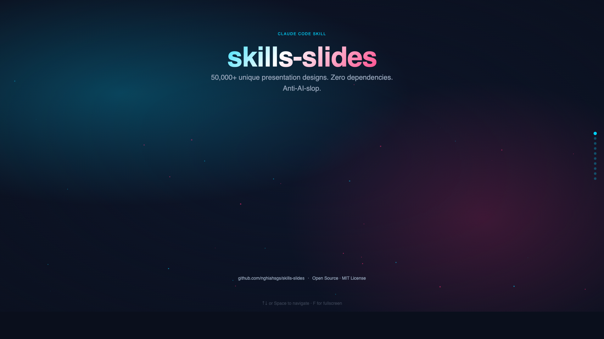
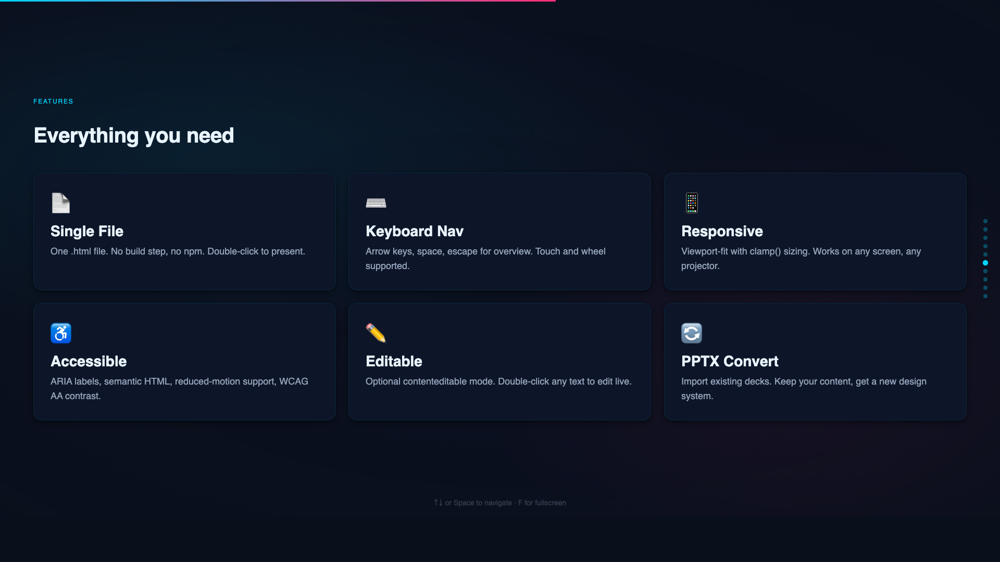
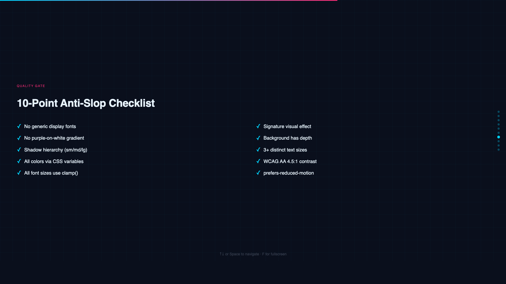

# slides

A Claude Code skill that generates stunning HTML presentations. Zero dependencies. Works offline. Opens in any browser.

**50 aesthetics × 20 palettes × 10 fonts × 5 layouts × 30+ effects = 50,000+ unique design combinations.**

Every presentation ships as a single `.html` file — no build step, no npm, no PowerPoint. Just double-click to present.

**[Live Demo →](https://nghiahsgs.github.io/skills-slides/)**

<p align="center">
  
</p>

<p align="center">
  
  
</p>

---

## Why this exists

AI-generated slides look the same: purple gradients, Inter font, identical shadows, flat backgrounds. This skill fights that with a **token-based design system** and a strict **anti-slop checklist** that catches generic patterns before delivery.

The result: presentations that look intentionally designed, not template-generated.

---

## What's inside

```
tokens/              # The design system
├── aesthetics.csv       # 50 named styles (startup-pitch, neon-cyber, editorial-minimal...)
├── color-palettes.csv   # 20 palettes with full hex values + WCAG ratios
├── font-pairings.csv    # 10 curated pairs from Google Fonts & Fontshare
├── layout-patterns.csv  # 5 CSS grid templates
└── effects-library.csv  # 30+ effects (particles, aurora, glassmorphism, gradients...)

references/          # Build rules
├── viewport-base.css       # Mandatory CSS foundation — viewport-fit, clamp(), snap scroll
├── html-template.md        # Full HTML skeleton + SlidePresentation JS class
├── animation-patterns.md   # Entrance animations, tilt effects, magnetic buttons
├── anti-slop-checklist.md  # 10-point quality gate (see below)
└── css-effects-cookbook.md  # Copy-paste CSS/JS for every effect type

scripts/             # Token search CLI
├── search.py            # Find tokens by vibe keywords
└── core.py              # Search engine internals
```

---

## Quick start

### 1. Install as a Claude Code skill

Copy this repo into your Claude Code skills directory:

```bash
# Clone into Claude Code skills
git clone https://github.com/nghiahsgs/skills-slides.git ~/.claude/skills/slides
```

Or symlink if you prefer to keep it elsewhere:

```bash
git clone https://github.com/nghiahsgs/skills-slides.git ~/projects/skills-slides
ln -s ~/projects/skills-slides ~/.claude/skills/slides
```

### 2. Use it

In any Claude Code session, just ask for a presentation:

```
Make me a 10-slide pitch deck for an AI startup. Dark, techy, high energy.
```

Claude will:
1. Search tokens matching your vibe
2. Show you 3 visual directions to choose from
3. Generate a single `.html` file with full animations, responsive sizing, and keyboard navigation
4. Open it in your browser

### 3. Search tokens directly

```bash
# Find aesthetics by vibe
python scripts/search.py "dark futuristic" --domain aesthetic -n 5

# Find palettes by color/mood
python scripts/search.py "warm gold luxury" --domain palette -n 3

# Get the full compatible design system for a style
python scripts/search.py --compatible startup-pitch

# Fetch a specific token by ID
python scripts/search.py --get palette midnight-aurora
```

---

## Anti-slop checklist

Every presentation must pass 10 checks before delivery:

| # | Rule | Why |
|---|------|-----|
| 1 | No generic display fonts (Inter, Roboto, Arial) | Zero design investment signal |
| 2 | No purple gradient on white background | Most overused AI pattern |
| 3 | Shadow hierarchy (sm/md/lg tokens) | Flat = unfinished |
| 4 | All colors via CSS variables | Prevents hex drift |
| 5 | All font sizes use `clamp()` | Fixed px breaks on different screens |
| 6 | At least 1 signature visual effect | Static slides aren't presentations |
| 7 | Background has texture/gradient/depth | Flat solid = unfinished |
| 8 | 3+ distinct text sizes | Hierarchy guides the eye |
| 9 | WCAG AA 4.5:1 contrast on all text | Accessibility is non-negotiable |
| 10 | `prefers-reduced-motion` media query | ~35% of adults 40+ have vestibular disorders |

---

## Design tokens

### Aesthetics (50)

Corporate, creative, tech, luxury, editorial, playful, dark, and more. Each aesthetic defines compatible palettes, fonts, layouts, and signature effects.

Examples: `startup-pitch` · `neon-cyber` · `editorial-minimal` · `luxury-noir` · `consulting-swiss` · `vaporwave` · `terminal-hacker` · `ai-ml-showcase`

### Palettes (20)

Full color systems with backgrounds, surfaces, text, accents, borders, and glow colors. Every palette ships with WCAG contrast ratios.

Examples: `midnight-aurora` · `crimson-signal` · `electric-indigo` · `rose-gold` · `arctic-frost` · `carbon-fiber`

### Fonts (10)

Curated display + body pairs. No generic system fonts. Sources include Google Fonts and Fontshare.

Examples: `clash-satoshi` · `fraunces-worksans` · `syne-spacemono` · `bodoni-dmsans`

### Effects (30+)

Complete CSS + JS snippets for every effect. Each tagged with performance impact and compatible aesthetics.

Examples: `particle-bg` · `gradient-mesh` · `aurora-flow` · `grid-overlay` · `glassmorphism` · `noise-texture` · `magnetic-cursor`

---

## Features

- **Single file output** — one `.html`, no dependencies, works forever
- **Keyboard navigation** — arrow keys, space, escape
- **Responsive** — viewport-fit with `clamp()` sizing, works on any screen
- **Accessible** — ARIA labels, semantic HTML, reduced-motion support
- **Offline** — fonts load from CDN but everything else is self-contained
- **Editable** — optional `contenteditable` mode for in-browser text editing
- **PPTX/PDF conversion** — import existing decks, apply new design system
- **PDF export** — Chrome headless print support built in

---

## License

MIT

---

*Built for [Claude Code](https://claude.ai/code) by developers who are tired of AI slides looking like AI slides.*
